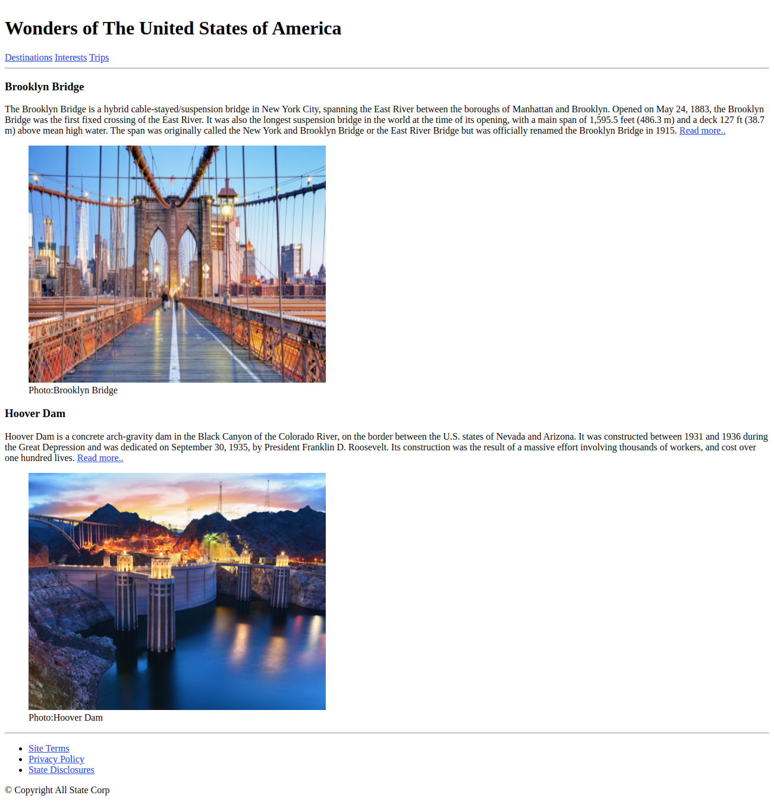

# Engineering Wonders of United States of America

Our world is filled with the most unique structures that are both man-made and natural. Some of the man-made creations include churches, tombs, temples, monuments, mosques, buildings and even cities. These structures have withstood the test of time and they continue to leave many awestruck with their brilliance. There are many in the world, but only few are selected, which are deemed to be the best.

## Problem Statement

Create a web page using HTML5 semantic elements that lists down two engineering wonders of the United States of America​.

Being a developer create a replica of below image.
