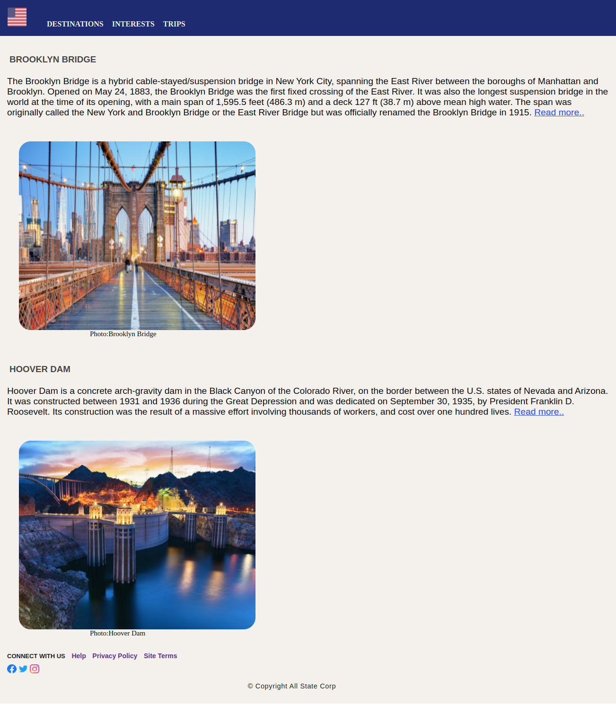

# Engineering Wonders of the United States of America

## Context

The United States is a land of unparalleled engineering achievements. From the majestic Brooklyn Bridge in New York to the Hoover Dam on the Arizona-Nevada border, America is home to some of the most awe-inspiring engineering feats in the world.

The Brooklyn Bridge is one of the oldest bridges in America, completed in 1883. It spans the East River, connecting Brooklyn and Manhattan. The bridge has been called an engineering marvel due to its construction techniques and the fact that it was the first bridge to span a major river.

The Hoover Dam is another engineering marvel. Completed in 1936, it spans the Colorado River and provides hydroelectric power to Arizona and Nevada. The dam is an impressive sight, standing over 700 feet high and containing over 12 million cubic yards of concrete.

## Problem Statement

Use CSS3 style properties to style the web page that lists down the two engineering wonders of the United States of America​​. 

Crteate a replica of the below image.

#### Details

Color codes used in the web page:
- #f4f1ec (entire document)
- midnightblue (header)
- lightgoldenellow (hyperlinks)
- #444 (headings in content sections)
- #171717 (copyright text)

Fonts used in this web page:
- Segoe UI, Tahoma, Geneva, Verdana, and sans-serif (headings in content sections)
- Gill Sans, Gill Sans MT, Calibri, Trebuchet MS, sans-serif (paragraphs in content sections)
- san-serif (footer content)

