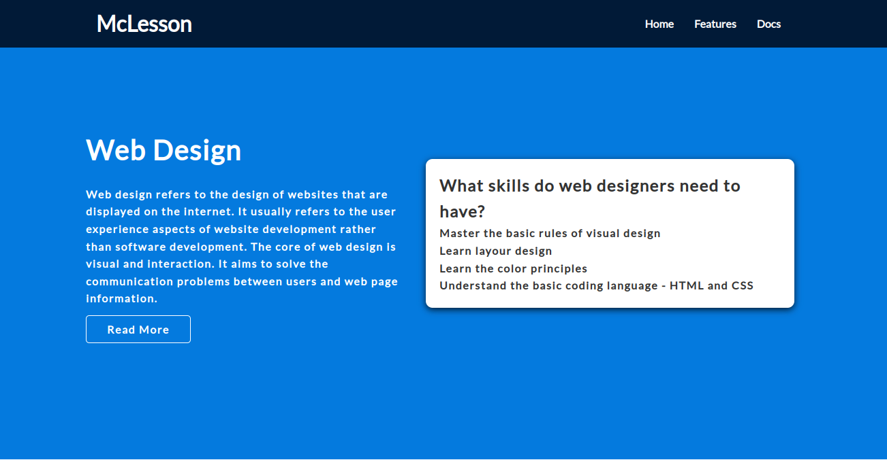
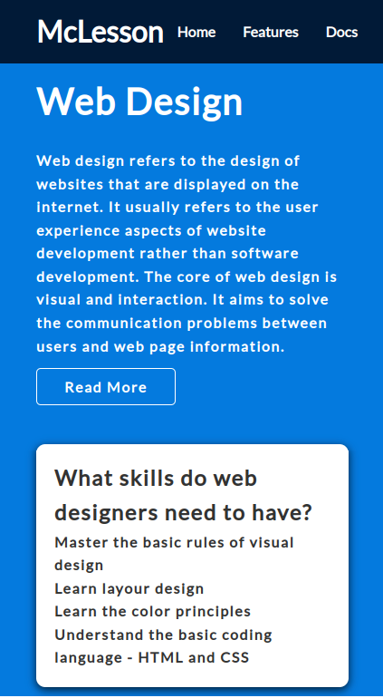

# Develop a Responsive Web Page for McLesson

# Context

McLesson is an online course platform which provides learning content for various IT streams. It provides an easy-to-use interface, high-quality content, and a variety of courses to choose from. The interface is simple and easy to navigate, so you can quickly find the information you need. ​
​
As a first step, you need to develop the landing page of McLesson website.

## Problem Statement

Develop a landing page for McLesson that contains a header with a brand name, navigation links, and a primary unit to present the core idea of the web page.  The web page should be optimized for both desktop and mobile devices. 

The web page should resemble the images as shown below.

### Details

- Color codes used in this web page are:
    - #047ade (Hero unit)
    - #fff (Font color for nav links and hero unit text contents)
    - #333 (Text inside card)
    - #011a37 (Navbar background color)
    - Black (box-shadow)
- Font family used is:
    - Lato, san-serif